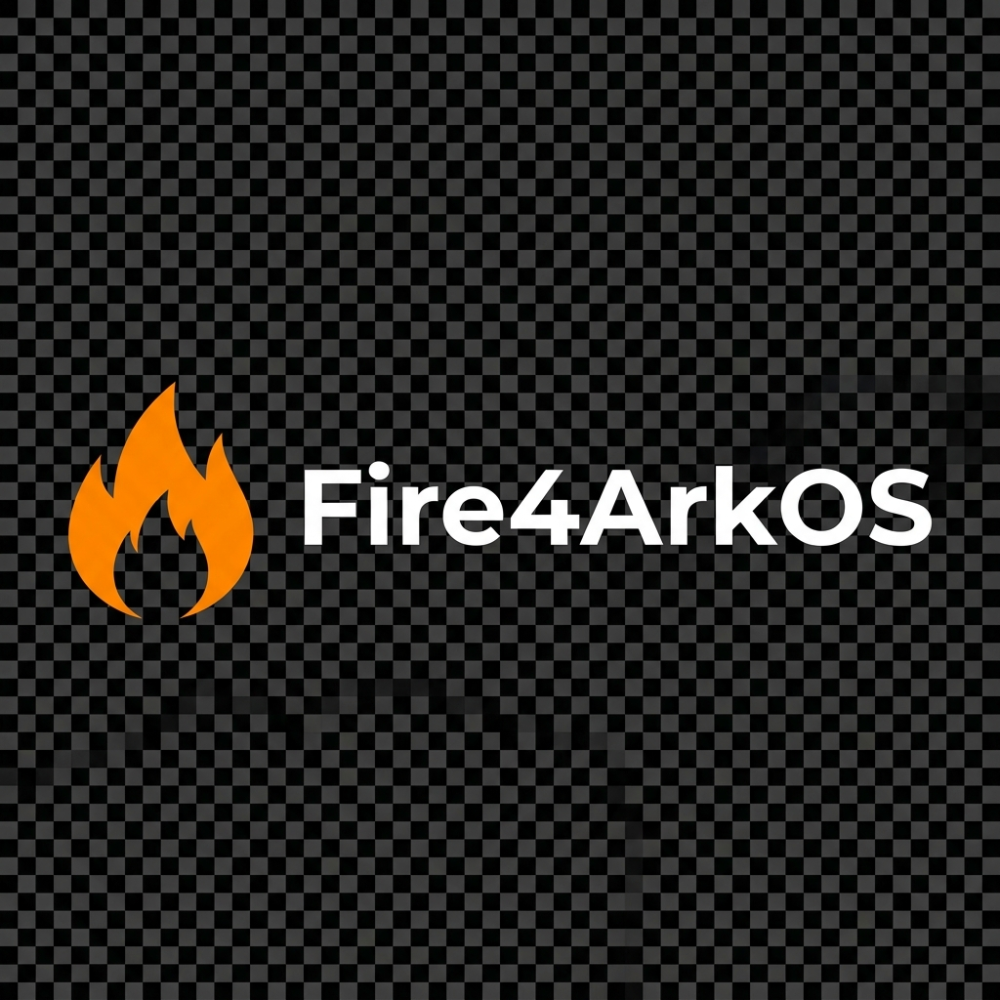

#  Fire4ArkOS Browser

Fire4ArkOS is a lightweight SDL2 frontend for the Firefox web browser, specifically optimized for handheld devices running ArkOS (RK3326). It provides a full desktop-class browsing experience while maintaining the responsiveness required for handheld gaming devices.

## 🛠️ Installation

**Fire4ArkOS v1.5.31** features ironclad SDL protection to prevent graphics regressions and a simplified one-click installer for RK3326-based devices.

### 1. Download & Prepare
- Download the latest `Fire4ArkOS.zip` from the [Releases](https://github.com/Cheemsdoge28/fire4arkos/releases) page.
- Extract the zip file on your computer. You will see a `Fire4ArkOS` folder.

### 2. Copy to Handheld
- Connect your ArkOS SD card (EASYROMS partition) to your computer.
- Copy the `Fire4ArkOS` folder into the `tools` directory on your SD card.
- Path: `EASYROMS/tools/Fire4ArkOS/`

### 3. One-Click Install
- Insert the SD card back into your device and boot ArkOS.
- Navigate to the **Tools** (or Options) section in EmulationStation.
- Find and run **install-from-es.sh**.
- Wait for the installer to finish, then **reboot your device**.

Once rebooted, a new system named **"Fire4ArkOS"** will appear in your frontend list!

> [!IMPORTANT]
> **Audio Status**: While the audio pipeline is now "Ironclad" (Direct ALSA via apulse), some hardware revisions remain silent. We are currently investigating this as a kernel-level issue.

## 🎮 Controls

| Button | Action |
|--------|--------|
| **Left Stick** | Mouse Cursor |
| **A / R1** | Left Click |
| **B / L1** | Back (Previous Page) |
| **X** | URL Entry / Virtual Keyboard |
| **Y** | Refresh Page |
| **L2 / R2** | Zoom Out / Zoom In |
| **D-Pad** | Scroll Up/Down/Left/Right |
| **Select + Start** | Exit Browser |

- **Stability**: The browser uses a custom performance profile to ensure smooth operation on the RK3326 SoC. If a page feels unresponsive, give it a moment to process heavy JavaScript.
- **Audio**: Audio is supported via a custom PulseAudio/apulse shim. Ensure your volume is turned up before launching.
- **Stick Drift**: If your cursor moves on its own, you can adjust the deadzone in `src/main.cpp` and run `sudo bash install.sh --rebuild`.

## 🚀 Performance Optimization

For the smoothest experience, we highly recommend the following system tweaks in your ArkOS settings:
1. **CPU Governor**: Set to **Performance**.
2. **ZRAM**: Set to **1024MB**. 
   - *Note: This is critical for preventing browser crashes on memory-heavy sites like Reddit or Discord.*

## 🏗️ Architecture
Fire4ArkOS works by running a headless instance of Firefox in the background. It captures the browser's output via Shared Memory (SHM) and renders it to the screen using SDL2. Input from your handheld's buttons is translated into mouse and keyboard events and sent to Firefox via a high-performance IPC pipe.

## 📜 License

GPL-3.0 License. See [LICENSE](LICENSE) for details.

---

## 💎 Open Source / Support

Fire4ArkOS is fully open source (**GPLv3**). I’m building this because I love the handheld community and wanted a better way to browse on the go.

If you find the project useful and want to help it grow:
- **Optional Support**: [GitHub Sponsors](https://github.com/sponsors/Cheemsdoge28) is appreciated but never required.
- **Hardware Testing**: I am currently developing this on an **arkos4clone** device. If anyone has a spare, unused **real R36S** they'd like to donate for testing, it would help immensely in ensuring perfect compatibility for everyone.

No pressure at all—the project will always stay free and open.
